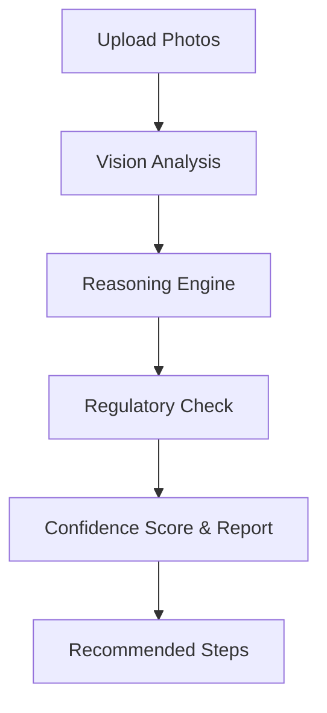

## Overview

ChairPulse provides AI-powered diagnostics to help you identify and resolve dental equipment issues quickly. Upload photos of error codes, symptoms, or equipment states, and the AI analyzes them with vision models, reasoning engines, and regulatory knowledge. Receive confidence scores, detailed reports, and step-by-step resolution guidance.

<Callout kind="info">
  Diagnostics works best with clear photos of error screens, equipment panels, and affected parts. Ensure good lighting and include model numbers when possible.
</Callout>

## Reporting an Equipment Error

Start by logging issues directly in the ChairPulse dashboard at `app.chairpulse.com`.

<Steps>
  <Step title="Select Equipment" icon="search">
    Navigate to the **Maintenance** tab and select the affected device, such as your A-Dec 500 dental chair or Midmark M11 autoclave.
  </Step>
  <Step title="Capture Evidence" icon="camera">
    Take photos of the error code (e.g., `E-24 Pressure Error`), damaged parts, or symptoms. Upload up to 5 images.
  </Step>
  <Step title="Submit for AI Diagnosis" icon="zap">
    Click **AI Diagnose**. The system processes images in seconds and generates a report.
  </Step>
</Steps>

## AI Analysis and Confidence Scoring

The AI orchestrates specialized models: vision for image analysis, reasoning for root cause, and search for compliance-linked issues. Reports include:

- **Confidence Score**: Percentage match (e.g., 94%) based on similar past cases.
- **Diagnostic Summary**: Likely causes and affected components.
- **Linked Regulations**: Jurisdiction-specific rules (e.g., California spore testing).



## Handling Diagnosis Results

Use tabs below for common scenarios based on confidence levels.

<Tabs>
  <Tab title="High Confidence (>90%)" icon="check-circle">
    
    Follow the auto-generated steps. Example for `E-24 Pressure Error` on Midmark M11:

    1. Inspect gasket for wear.
    2. Replace if damaged (part #MID-12345).
    3. Test pressure cycle.

    <Callout kind="success">
      Most high-confidence issues resolve without service calls, saving time and costs.
    </Callout>
  </Tab>
  <Tab title="Medium Confidence (70-90%)" icon="alert-triangle">
    
    Review recommendations and cross-check logs. Escalate if symptoms persist.

    <Expandable title="Detailed Gasket Replacement Guide" default-open="true">
      
      **Tools Needed:**
      - Replacement gasket (order via ChairPulse marketplace)
      - Torque wrench

      **Time Estimate:** 20 minutes

      ```bash
      # Log resolution in ChairPulse CLI (optional)
      chairpulse log --issue "E-24" --status "resolved" --cost 185
      ```
    </Expandable>
  </Tab>
  <Tab title="Low Confidence (<70%)" icon="help-circle">
    
    Use as initial guidance, then schedule service.
  </Tab>
</Tabs>

## Recommended Resolution Steps and Service Scheduling

Post-diagnosis, ChairPulse provides prioritized actions.

<Columns cols={2}>
  <Card title="Self-Resolve" icon="tools" href="#self-resolve">
    Follow AI steps for common fixes like cleaning sensors or resetting cycles.
  </Card>
  <Card title="Schedule Service" icon="calendar" href="#schedule-service">
    One-click booking with certified technicians. Track status: Logged → Diagnosing → Scheduled → Resolved.
  </Card>
</Columns>

<CodeGroup tabs="CLI,Dashboard">
  ```bash
  # CLI: Mark as resolved with cost
  chairpulse resolve --equipment "Midmark M11" --issue "E-24" --action "Gasket replaced" --cost 185
  ```
  ```javascript
  // API: Update issue status
  await fetch('https://api.example.com/v1/issues/123', {
    method: 'PATCH',
    headers: { 'Authorization': 'Bearer YOUR_TOKEN' },
    body: JSON.stringify({
      status: 'resolved',
      resolution: 'Gasket replaced',
      cost: 185
    })
  });
  ```
</CodeGroup>

## Next Steps

Review your compliance dashboard for related requirements. For persistent issues, contact support via the app.

<Callout kind="tip">
  Enable notifications for proactive alerts on equipment nearing failure thresholds.
</Callout>