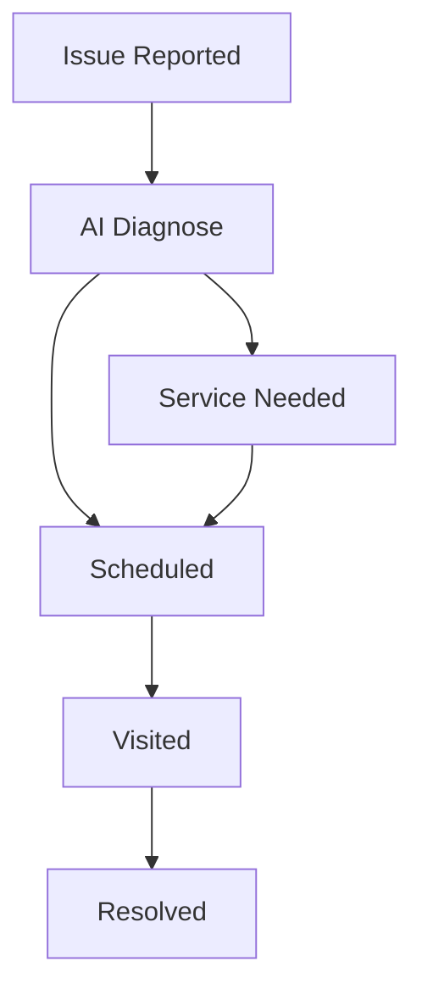

## Overview

ChairPulse provides intelligent tools to streamline dental office operations. You manage maintenance, procedures, diagnostics, and compliance from a unified dashboard. Key features include automated scheduling, AI-generated SOPs, lifecycle tracking, and regulatory automation tailored for dental equipment like chairs and autoclaves.

<Callout kind="info">
ChairPulse sets up in 1-3 days and scales your operations like a multi-location practice.
</Callout>

<Columns cols={2}>
  <Card title="Maintenance Scheduling" icon="settings" href="#maintenance">
    Automate daily, weekly, and monthly tasks for all equipment.
  </Card>
  <Card title="SOP Generation" icon="file-text" href="#sops">
    AI-powered standard operating procedures with step-by-step guides.
  </Card>
  <Card title="Lifecycle Tracking" icon="trending-up" href="#lifecycle">
    Monitor status from logged to resolved across your inventory.
  </Card>
  <Card title="Compliance Automation" icon="shield" href="#compliance">
    Jurisdiction-specific requirements linked to your equipment.
  </Card>
</Columns>

## Automated Maintenance Scheduling

Set up proactive maintenance to prevent downtime. ChairPulse auto-populates tasks based on your equipment inventory, such as cleaning handpiece couplers on A-Dec 500 chairs.

### Quick Setup Steps

<Steps>
  <Step title="Add Equipment" icon="database">
    Select your dental chair or autoclave from the catalog.
  </Step>
  <Step title="Configure Schedule" icon="calendar">
    Choose frequencies: daily critical, weekly, or monthly.
  </Step>
  <Step title="Assign Tasks" icon="users">
    Notify staff via app notifications or email.
  </Step>
</Steps>

Integrate via API for custom workflows.

<CodeGroup tabs="JavaScript,cURL">
  ```javascript
  const response = await fetch('https://api.chairpulse.com/v1/tasks', {
    method: 'POST',
    headers: {
      'Authorization': 'Bearer YOUR_API_KEY',
      'Content-Type': 'application/json'
    },
    body: JSON.stringify({
      equipmentId: 'a-dec-500-123',
      task: 'Clean handpiece couplers',
      frequency: 'daily'
    })
  });
  ```
  ```bash
  curl -X POST https://api.chairpulse.com/v1/tasks \
    -H "Authorization: Bearer YOUR_API_KEY" \
    -H "Content-Type: application/json" \
    -d '{
      "equipmentId": "a-dec-500-123",
      "task": "Clean handpiece couplers",
      "frequency": "daily"
    }'
  ```
</CodeGroup>

## SOP Generation and Documentation

Generate and document standard operating procedures instantly. ChairPulse uses AI to create protocols like weekly spore testing.

<Tabs>
  <Tab title="Spore Testing" icon="flask">
    Auto-generated SOP for autoclaves.

    #### Materials
    - Biological indicator vial
    - Incubator
    - Log sheet

    #### Steps
    1. Place indicator in load center
    2. Run sterilization cycle
    3. Incubate 24-48 hours

    <Callout kind="tip">
      Log completion in-app to track compliance.
    </Callout>
  </Tab>
  <Tab title="Waterline Testing" icon="droplets">
    Protocol for dental units.

    Run monthly tests and upload results. AI analyzes for issues.
  </Tab>
</Tabs>

## Equipment Lifecycle Tracking

Track issues from diagnosis to resolution. Statuses include Logged, Diagnosing, Scheduled, Visited, and Resolved.



For example, an E-24 pressure error on a Midmark M11 autoclave shows 94% confidence AI report with recommended steps.

<ParamField path="equipmentId" param-type="string" required="true">
  Unique ID from your inventory, e.g., `midmark-m11-456`.
</ParamField>

## Regulatory Compliance Automation

Automate compliance based on your location. For California practices, link spore testing to autoclaves and waterline checks to dental units.

| Jurisdiction | Key Requirements | Linked Equipment |
|--------------|------------------|------------------|
| California  | Spore Testing, Waterline | Autoclaves (3), Dental Units (8) |
| Texas       | Annual Calibration | All Equipment |
| New York    | Biohazard Logging | Sterilizers |

<Expandable title="Advanced Compliance Setup" default-open="false">
  Customize rules via dashboard at [app.chairpulse.com](https://app.chairpulse.com/compliance).

  Use webhooks for external logging:

  ````javascript
  // Webhook payload example
  {
    "event": "compliance_due",
    "equipment": "a-dec-500",
    "jurisdiction": "CA",
    "dueDate": "2024-11-15"
  }
  ````
</Expandable>

<Callout kind="success">
  You're compliant when all tasks are scheduled and tracked.
</Callout>