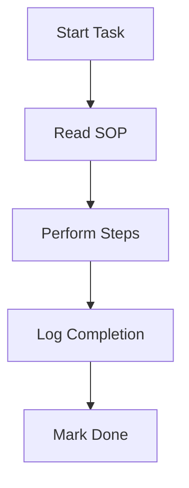

## Prerequisites

<Callout kind="info" title="Before You Begin">
  
- An active email address for account verification
- Your practice address (for jurisdiction-specific compliance)
- Details of your dental equipment (model, serial number)
- Admin access to your practice management system (optional for integrations)

</Callout>

## Create Your Account

Sign up for ChairPulse in under 2 minutes. Head to the [app at app.chairpulse.com](https://app.chairpulse.com/signup).

<Steps>
  <Step title="Sign Up" icon="user-plus">
    
1. Visit `https://app.chairpulse.com/signup`.
2. Enter your email and create a password.
3. Agree to the terms and click **Create Account**.

  </Step>
  <Step title="Verify Email" icon="mail">
    
Check your inbox for a verification email from ChairPulse. Click the link to activate your account.

If you don't see it, check your spam folder.

  </Step>
  <Step title="Log In" icon="log-in">
    
Return to `https://app.chairpulse.com/login` and sign in with your credentials.

You'll land on the setup wizard.

  </Step>
</Steps>

## Set Up Your Practice and Equipment

Enter your practice details to enable auto-populated maintenance tasks and compliance rules based on your location.

<Tabs>
  <Tab title="Practice Info" icon="home">
    
Follow the setup wizard:

1. Select your state (e.g., California).
2. Add practice name and address.
3. Optionally, connect your calendar for scheduling.

ChairPulse auto-detects relevant regulations like spore testing for autoclaves.

  </Tab>
  <Tab title="Add Equipment" icon="tool">
    
Add your first device:

````jsx
// Example equipment config (via dashboard or API)
{
  "model": "A-Dec 500",
  "type": "dental-chair",
  "serial": "ADC123456",
  "installDate": "2024-01-15"
}
````

Click **Add Equipment** and search for your model. Tasks like "Clean handpiece couplers" auto-populate.

  </Tab>
</Tabs>

## Dashboard Tour

Once set up, explore the main areas:

<Columns cols={3}>
  <Card title="Maintenance & SOPs" icon="settings" href="#maintenance">
    
View auto-generated tasks (Daily, Weekly). Log completions and track history.

  </Card>
  <Card title="Diagnostics" icon="zap" href="#diagnostics">
    
Upload equipment photos for AI analysis. Get step-by-step fixes.

  </Card>
  <Card title="Compliance" icon="shield" href="#compliance">
    
Jurisdiction-specific requirements linked to your gear. Stay audit-ready.

  </Card>
</Columns>

## Launch Your First Task

<Steps>
  <Step title="Select Task" icon="check-circle">
    
From the dashboard, pick "Clean and lubricate handpiece couplers" (Daily Critical).

  </Step>
  <Step title="Follow SOP" icon="list">
    



Take photos if prompted for verification.

  </Step>
  <Step title="Review Status" icon="eye">
    
Tasks update to "Logged", "Scheduled", or "Resolved" automatically.

  </Step>
</Steps>

<Callout kind="tip" title="Pro Tip">
  
Invite team members via the **Users** tab to assign tasks collaboratively.

</Callout>

## Next Steps

<Columns cols={2}>
  <Card title="Deep Dive: Maintenance" icon="book-open" href="/maintenance">
    
Explore full SOP library and scheduling.
  </Card>
  <Card title="AI Diagnostics Guide" icon="brain" href="/diagnostics">
    
Learn photo upload and troubleshooting.
  </Card>
</Columns>

<Expandable title="Advanced: API Integration" default-open="false">
  
For automation, use the ChairPulse API:

<CodeGroup tabs="cURL,JavaScript">
```bash
curl -X POST https://api.example.com/v1/equipment \
  -H "Authorization: Bearer YOUR_API_KEY" \
  -H "Content-Type: application/json" \
  -d '{
    "model": "Midmark M11",
    "type": "autoclave"
  }'
```

```javascript
const response = await fetch('https://api.example.com/v1/tasks', {
  headers: {
    'Authorization': 'Bearer YOUR_API_KEY'
  }
});
const tasks = await response.json();
console.log(tasks);
```
</CodeGroup>

Get your `{API_KEY}` from **Settings > API**.

</Expandable>